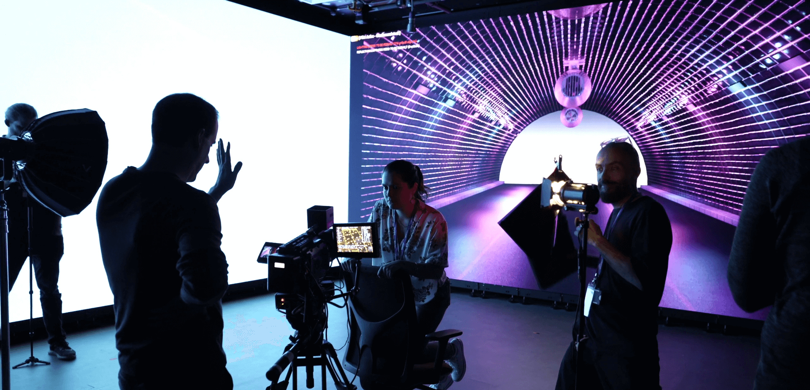

# CoSTAR National Lab 

____

 

Welcome to the GitHub organisation for the CoSTAR National Lab. 

 

CoSTAR provides UK companies with access to today's cutting-edge technologies and research expertise to power the stories of tomorrow.  

 

Convergent Screen Technologies and performance in Realtime, or CoSTAR for short, is a £75.6 million investment by the UKRI Infrastructure Fund, delivered by the Arts and Humanities Research Council. The CoSTAR Network will provide world leading facilities, technology research and a series of different academic and industry partnerships to support the continued growth of our gaming, TV, film, performance, and digital entertainment sectors. 

 

The National Lab is the central hub of the CoSTAR Network, collaborating, innovating, and experimenting across the UK’s screen and performance sectors, supporting UK creative companies to innovate and grow ethically, sustainably, and inclusively. 

 

The code and repositories found in this organisation are the product of Prototyping and other development efforts happening in the CoSTAR National Lab. Where possible, we will favour an open-source approach to developing software, aiming to release the results of our work for the benefit of the wider community. 